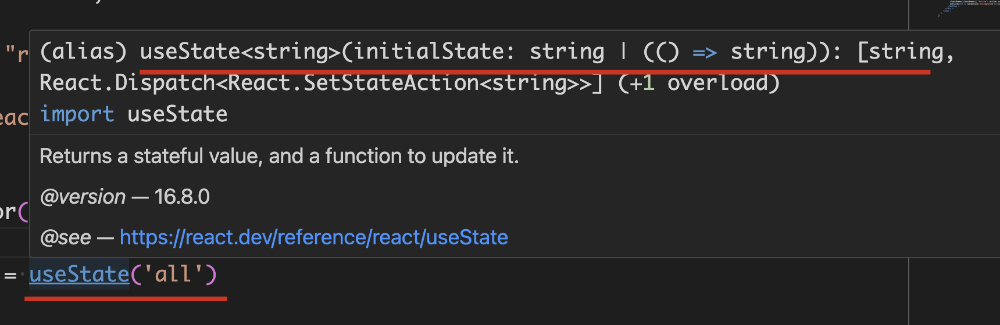

# React + TypeScript + React

## 1. `useRef`

`/src/componenets/TodoList/Input/index.tsx`


### 1.1. 指定 `HTML Element`

使用 `useRef` 的时候， 要指定 `HTML Element`。 全部元素在 https://developer.mozilla.org/en-US/docs/Web/API/HTMLInputElement

```tsx
  // https://developer.mozilla.org/en-US/docs/Web/API/HTMLInputElement
  const inputRef = useRef<HTMLInputElement>(null);
```

### 1.2. 判断 xxxRef.current 是否存在

由于 `xxxRef.current` 可能不存在， 因此使用的时候需要判断存在才能取值 `xxxRef.current.value`

**方式一**, 使用 **问号**

```ts
xxxRef.current?value
```

**方式二**， 使用 逻辑语句

```tsx
  const addItem = () => {
    // 如果值为空，不添加
    if (!inputRef.current?.value) {
      return
    }

    const item: ToDo = {
      id: Date.now(),
      title: inputRef.current?.value,
      completed: false
    }

    // dispath 调用 action 添加新条目
    dispatch(addTodo(item))
    // 添加完成后清空 input 框
    inputRef.current!.value = ""
  }
```


## 2. `useState`

`/src/componenets/TodoList/index.tsx`

```tsx
const [active, setActive] = useState('all')
```
**简单类型** 会自动推断




如果是 **复杂类型** ， 可以通过 **泛型传值** 执行。 例如这里的 Todos

```tsx
import { Todos } from '../../types'

const [todos, setTodos] = useState<Todos>([])
```

## 3. `redux`

### 3.1. 导出 store 的 `IRootState`

参考: https://stackoverflow.com/a/60223837

```tsx
// 在 store/index.ts 中

// https://stackoverflow.com/a/60223837
export type IRootState = ReturnType<typeof store.getState>
```

### 3.2. 使用 `useSelector` 指定 state 类型

在使用 `useSelector` 指定 state 类型

```tsx
// 导入
import { IRootState } from "../../../store"

// 使用
let { todos } = useSelector((state: IRootState) => state.todolist)
```